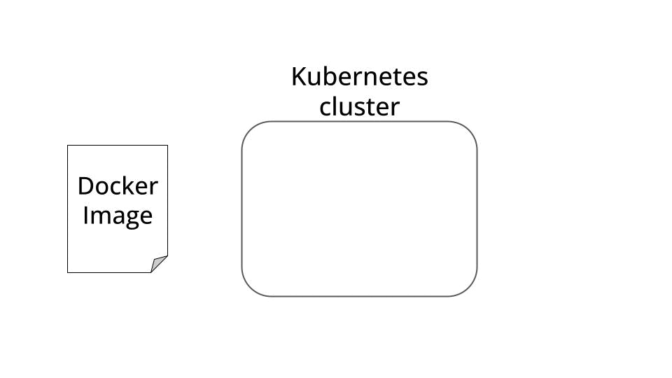

<div align="center">
    <h2> </h2>
    <h1>Build and deploy a professional REST API to Kubernetes with <a href="https://gimlet.io">Gimlet</a> 🚀</h1>
    
</div>

#### Table of contents
* [Our goal](#our-goal)
* [How to run the API locally?](#how-to-run-the-api-locally)
* [How to deploy the API to Kubernetes with Gimlet?](#how-to-deploy-the-api-to-kubernetes-with-gimlet)
* [Wanna learn more real-world ML?](#wanna-learn-more-real-world-ml)

## Our goal

Let’s **build** and **deploy** a production-ready REST API that can serve data on historical taxi rides in NYC.

The original data is stored in one-month parquet files [on this website](https://www.nyc.gov/site/tlc/about/tlc-trip-record-data.page), and our goal is to make it easily accessible to the WORLD through a REST API.


## How to run the API locally?

Git clone this repository, cd into the root directory of the project and then run the following commands using make.

1. Install [Python Poetry](https://python-poetry.org/docs/#installation) (if necessary)
and create an isolated virtual environmnet for development purposes.
    ```
    $ make install
    ```

2. Test, build and run the dockerized REST API with
    ```
    $ make all
    ```

3. Check the API is up and running locally, and that you can connect to it
    ```
    $ make health-check-local
    ```

4. Send a sample request to the local API
    ```
    $ make sample-request-local
    ```

Good job. The API is up and running locally. However, until you don’t deploy it to a production environment, and make it accessible to

* your clients 💁🏻‍♀️
* your colleagues 👨🏻‍💼
* or the whole world 🌏

your real-world impact is **ZERO**.

Let me show you how to deploy this API to a production Kubernetes cluster.


> **What is Kubernetes? ☸📦** 
>
> Kubernetes is an open-source container orchestration platform that automates the deployment, scaling, and management of your Dockerized apps
>
> It is currently the most widely used container orchestration platform in the world, and it has become the de facto standard due to its robust features, large community support, and backing from major tech companies.

## How to deploy the API to Kubernetes with Gimlet?

[Gimlet](https://gimlet.io/) is a tool that helps you quickly deploy your apps to ANY Kubernetes cluster.

- You can do it entirely from the Gimlet UI, as explained in this article.

or

- You can adjust the [gimlet manifest in this repository](https://github.com/Paulescu/taxi-data-api-python/blob/main/.gimlet/electric-paper-taxi-data-api-python.yaml), to automatically deploy your code changes to the main branch.

## Wanna see my API in action?
[👉🏽 Click here to ping my API](https://paulescu-taxi-data-api-python-ayolbhnl.gimlet.app/trips?from_ms=1674561817000&n_results=100)


## Wanna learn more real-world ML?

Join more than 19k builders to the [**Real-World ML Newsletter**](https://www.realworldml.net/subscribe). Every Saturday morning.

### [👉🏽 Click here to subscribe for FREE](https://www.realworldml.net/subscribe)

### [**👉🏽 My live courses on Real World ML**](https://www.realworldml.net/courses)


